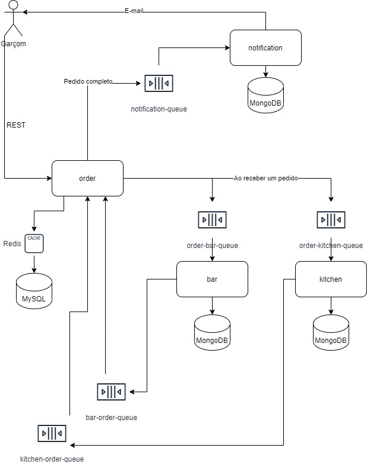

Restaurante com MS
---
Implementar uma cadeia de microserviços para o fluxo de pedidos em um restaurante.

### Fluxo



### Payload

```json
{
  "id": "(use um id gerado pelo código)",
  "waiter": "João Garçom",
  "table": 22,
  "kitchenItens": [
    {
      "name": "Entrada",
      "quantity": 1,
      "note": "Cliente pediu menos salada"
    },
    {
      "name": "Prato principal",
      "quantity": 2,
      "note": "Cliente pediu menos salada"
    }
  ],
  "barItens": [
    {
      "name": "Coca-Cola",
      "quantity": 1,
      "note": "Sem gelo"
    },
    {
      "name": "Cerveja",
      "quantity": 1,
      "note": ""
    }
  ],
  "statusBar": "PREPARING",
  "statusKitchen": "PREPARING"
}

```

### Requisitos

#### Order

Ao receber uma requisição de pedido, postar nas respectivas filas os itens de bar (orderbar- queue) e de cozinha (
order-kitchen-queue), junto com o ID do pedido;

Caso uma das listas esteja vazia, troque o status para DONE, não permita um pedido com as duas listas de itens vazias;

Guardar no banco a entrada do pedido;

> GET /orders -> Usar o redis para cachear essa listagem


Criar um consumer das filas (kitchen-order-queue e bar-order-queue):

Ao receber a notificação no consumer você deverá checar o status do outro aspecto, se já estiver em done, postar uma
mensagem na notification-queue comunicando que o pedido está pronto, caso contrário só trocar o respectivo status para
DONE.

### Bar

Criar um consumer para a order-bar-queue e registar o item no seu DB, adicionando um campo status;

Considere os itens todos de um pedido como um só pedido!
> PATCH /bar-orders/<id>

Troque o status para pronto e submeta uma mensagem para a bar-order-queue;

### Kitchen

Criar um consumer para a order-kitchen-queue e registar o item no seu DB, adicionando um campo status;

Considere os itens todos de um pedido como um só pedido!
> PATCH /kitchen-orders/<id>

Troque o status para pronto e submeta uma mensagem para a kitchen-order-queue;

### Notification

Criar um consumer para a notification-queue e enviar um e-mail com base no payload recebido;

A entrega deverá ser uma resposta em texto com todos os seus repositórios.